# Project Class Diagram

**Scope**: the whole system, one diagram. Each `namespace` below is one package under
`src/`; only the classes and relationships that matter for understanding how data
flows from a raw repository to a browsable, self-updating wiki are shown — not every
field or method (see each package's own module docstrings/tests for full detail).

> Maintenance: update this diagram whenever a class is added, removed, or its
> cross-package relationships change.

```mermaid
classDiagram
    namespace Scanner {
        class ScanResult {
            +str root_path
            +list~SourceFileEntry~ entries
        }
        class SourceFileEntry {
            +str relative_path
            +str language
        }
    }

    namespace ParserEngine {
        class FileSymbolInventory {
            +str sourceFile
            +ModuleSymbol module
            +list~ClassSymbol~ classes
            +list~FunctionSymbol~ functions
        }
        class Symbol {
            <<abstract>>
            +str id
            +str name
            +str generatedSummary
        }
        class ModuleSymbol
        class ClassSymbol
        class FunctionSymbol
    }
    Symbol <|-- ModuleSymbol
    Symbol <|-- ClassSymbol
    Symbol <|-- FunctionSymbol
    FileSymbolInventory *-- Symbol

    namespace DependencyGraphPackage {
        class DependencyGraph {
            +dict~str,DependencyNode~ nodes
            +ingest_inventory(inventory)
            +remove_source_file(source_file)
            +dependents(focus) list~DependencyNode~
            +exportDiagram(root) DiagramExport
        }
        class DependencyNode {
            +str id
            +str kind
            +str sourceFile
        }
        class DependencyEdge {
            +str sourceId
            +str targetId
            +str type
        }
    }
    DependencyGraph *-- DependencyNode
    DependencyGraph *-- DependencyEdge

    namespace RepositoryMetadata {
        class RepositoryMetadataStore {
            +store_inventory(root, file, inventory, hash)
            +has_file_changed(root, path, hash) bool
            +delete_source_file(root, path)
            +load_repository(root) RepositoryBundle
        }
        class RepositoryBundle {
            +Repository repository
            +tuple~SourceFileBundle~ files
        }
        class Repository {
            +str id
            +str rootPath
        }
    }
    RepositoryMetadataStore ..> RepositoryBundle : loads
    RepositoryBundle *-- Repository

    namespace VectorIndexAndEmbeddings {
        class EmbeddingEngine {
            +embed(text) Vector
            +isAvailableLocally() bool
        }
        class VectorIndex {
            +reindexFile(path, chunks)
            +removeChunksForFile(path)
            +search(query, k) list~SearchResult~
        }
        class CodeChunk {
            +str id
            +tuple~float~ embedding
            +str sourceSymbolId
        }
    }
    VectorIndex *-- CodeChunk
    VectorIndex ..> EmbeddingEngine : embeds query text

    namespace LocalLLM {
        class LocalLLMEngine {
            +generate(prompt) str
            +isAvailableLocally() bool
        }
    }

    namespace CodeSummaryPipelinePackage {
        class CodeSummaryPipeline {
            +summarizeRepository(root, incremental, changed_paths) list~SummaryResult~
            +isReady() bool
        }
        class SummaryResult {
            +str symbolId
            +str generatedSummary
        }
    }
    CodeSummaryPipeline ..> SummaryResult : produces

    namespace ChatRAG {
        class ChatSession {
            +str id
            +list~ChatMessage~ messages
            +ask(question) ChatMessage
        }
        class ChatMessage {
            +str role
            +str content
            +tuple~str~ citedSymbolIds
        }
    }
    ChatSession *-- ChatMessage

    namespace DocGeneratorPackage {
        class DocGenerator {
            +generateRepositoryDocumentation(root, incremental, changedPaths, changedSymbolIds, changedDependencyEdgeIds) DocumentationSet
            +generateClassDiagramPage() DocPage
        }
        class DocPage {
            +str id
            +str kind
            +str contentMarkdown
        }
        class DocumentationSet {
            +tuple~DocPage~ pages
        }
        class ClassDiagramSelection {
            +tuple~SelectedClass~ includedClasses
            +tuple~tuple~str,str~~ inheritanceEdges
            +int omittedClassCount
        }
        class SelectedClass {
            +str classId
            +str name
            +tuple~SelectedMethod~ methods
        }
        class SelectedMethod {
            +str name
        }
        class ClassDiagramSource {
            +str sourceText
            +tuple~str~ includedClassIds
            +int omittedClassCount
        }
    }
    DocGenerator ..> DocumentationSet : produces
    DocumentationSet *-- DocPage
    ClassDiagramSelection *-- SelectedClass
    SelectedClass *-- SelectedMethod
    DocGenerator ..> ClassDiagramSelection : select_major_classes()
    ClassDiagramSelection ..> ClassDiagramSource : build_class_diagram_mermaid_source()

    namespace WebServer {
        class ChatApiApp {
            <<FastAPI app, chat_api/app.py>>
            +POST /sessions
            +POST /sessions/:session_id/messages
            +serves the wiki as static files
        }
    }

    namespace RepoWatcher {
        class RepositoryWatcher {
            +start()
            +stop()
        }
        class ChangeBatch {
            +tuple~FileChange~ changes
            +str origin
        }
        class FileChange {
            +str relative_path
            +ChangeType change_type
        }
    }
    RepositoryWatcher ..> ChangeBatch : on_batch(batch)
    ChangeBatch *-- FileChange

    namespace ReindexPipeline {
        class IncrementalReindexPipeline {
            +run(batch) ReindexOutcome
        }
        class ReindexOutcome {
            +tuple~str~ reprocessedPaths
            +tuple~str~ skippedPaths
            +tuple~str~ removedPaths
            +tuple~str~ regeneratedSymbolIds
            +tuple~str~ failedPaths
            +str summaryFailure
        }
    }
    IncrementalReindexPipeline ..> ReindexOutcome : returns

    namespace Cli {
        class CLIConfiguration {
            +str llmModel
            +str llmEndpointUrl
            +str embeddingModel
            +str embeddingEndpointUrl
        }
        class IndexRunResult {
            +Path docsRoot
            +VectorIndex vectorIndex
            +RepositoryWatcher watcher
        }
        class run_index {
            <<function, index_command.py>>
            +run_index(repo_path, config) IndexRunResult
        }
        class run_serve {
            <<function, serve_command.py>>
            +run_serve(repo_path, config) IndexRunResult
        }
        class run_config {
            <<function, config_command.py>>
            +run_config(llm_model, llm_endpoint, llm_generate_timeout, embedding_model, embedding_endpoint, embedding_generate_timeout, show)
        }
        class scan {
            <<function, main.py>>
            +scan(repo_path) ScanResult
        }
    }
    run_index ..> CLIConfiguration : reads
    run_serve ..> CLIConfiguration : reads
    run_config ..> CLIConfiguration : reads/writes
    run_index ..> IndexRunResult : returns
    run_serve ..> IndexRunResult : returns
    scan ..> ScanResult : scan_repository()

    %% Cross-package data flow
    CLIConfiguration ..> LocalLLMEngine : modelName/endpointUrl
    CLIConfiguration ..> EmbeddingEngine : modelName/endpointUrl
    run_index ..> ScanResult : scan_repository()
    run_index ..> DocGenerator : structure + content passes
    run_index ..> CodeSummaryPipeline : summarizeRepository()
    run_index ..> VectorIndex : update_embeddings() per file
    run_serve ..> RepositoryWatcher : on_batch=pipeline.run
    run_serve ..> IncrementalReindexPipeline : constructs
    ScanResult ..> FileSymbolInventory : each file is parsed into
    FileSymbolInventory ..> DependencyGraph : ingest_inventory()
    FileSymbolInventory ..> RepositoryMetadataStore : store_inventory()
    RepositoryBundle ..> CodeSummaryPipeline : symbol source + context
    DependencyGraph ..> CodeSummaryPipeline : dependents() for impact
    CodeSummaryPipeline ..> LocalLLMEngine : generate()
    CodeSummaryPipeline ..> RepositoryMetadataStore : writes summary back
    RepositoryMetadataStore ..> CodeChunk : symbol source text to embed
    EmbeddingEngine ..> CodeChunk : embed()
    VectorIndex ..> ChatSession : search() evidence
    LocalLLMEngine ..> ChatSession : generate() answer
    RepositoryBundle ..> DocGenerator : pages source
    DependencyGraph ..> DocGenerator : diagram pages
    DocumentationSet ..> ChatApiApp : served as static files
    ChatSession ..> ChatApiApp : POST /messages
    ChangeBatch ..> IncrementalReindexPipeline : run(batch)
    IncrementalReindexPipeline ..> FileSymbolInventory : re-parses changed files
    IncrementalReindexPipeline ..> DependencyGraph : targeted update
    IncrementalReindexPipeline ..> RepositoryMetadataStore : targeted update
    IncrementalReindexPipeline ..> CodeSummaryPipeline : targeted regeneration
    IncrementalReindexPipeline ..> VectorIndex : targeted re-embed
    IncrementalReindexPipeline ..> DocGenerator : targeted regeneration
```

