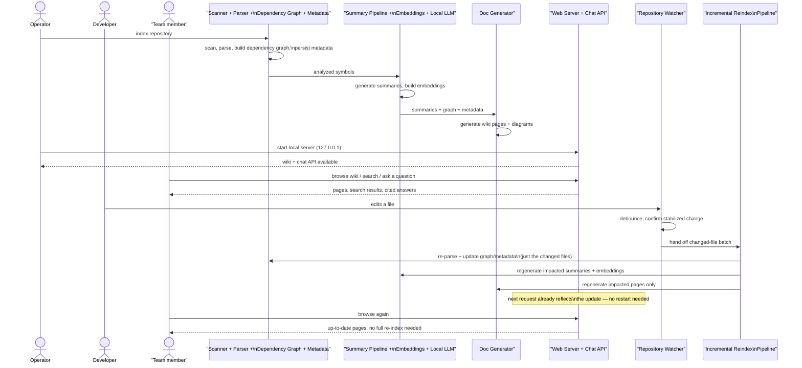

# Project Sequence Diagram — Overview

**Scope**: the whole system's lifecycle, one diagram — from pointing the tool at a
repository, through indexing, serving, everyday use, and self-updating on edits. Each
participant here is a whole subsystem (not a class); see the per-function diagrams in
this folder for the detail behind each block.

> Maintenance: update this diagram whenever a major phase of the system's lifecycle
> changes. See `README.md` in this folder.

