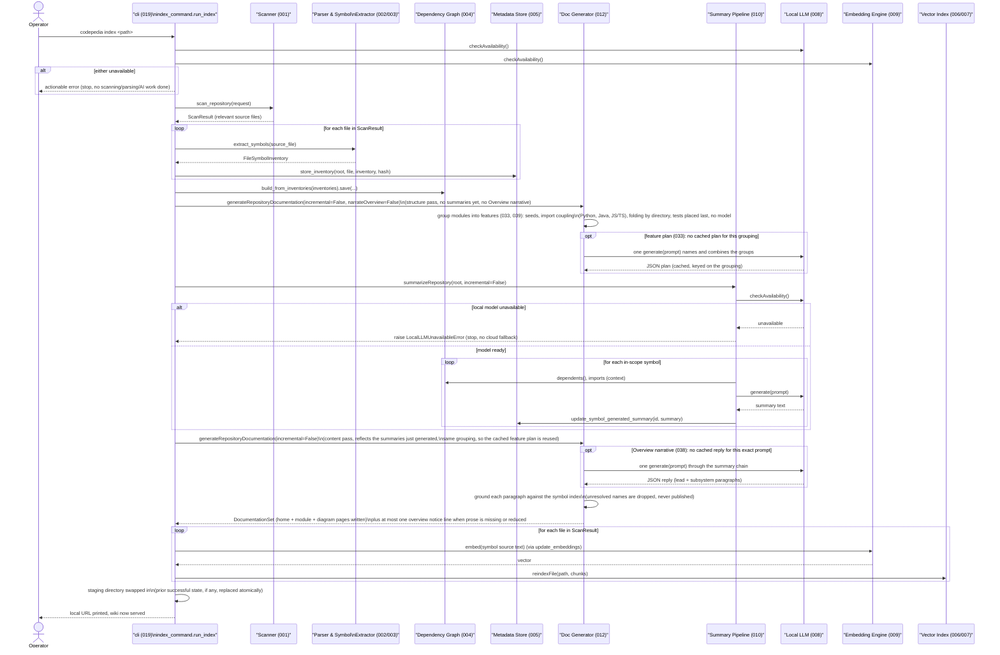

# Major Function: Full Repository Indexing

**Specs**: 001, 002/003, 004, 005, 009/010, 006/007, 012, 019, 033, 038, 039

The from-scratch flow: `codepedia index <path>` (019) points the tool at a
repository once, and it becomes a fully analyzed, summarized, embedded, and
documented wiki — staged into a temporary directory and swapped in only on
full success (research.md §10 of 019), so a failed run never corrupts a
previously-successful index.

