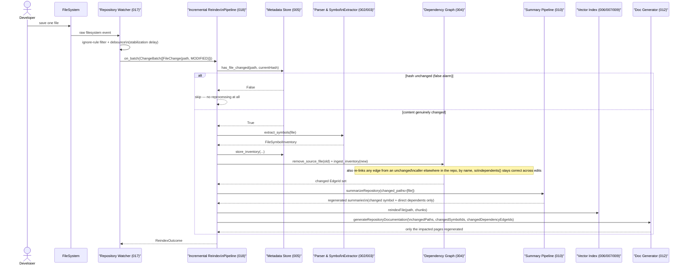

# Major Function: Incremental Reindexing (Watcher-Triggered)

**Specs**: 017, 018

The self-updating flow: a saved edit reaches the browsable wiki in seconds, touching
only what actually changed — never a full repository re-analysis.

