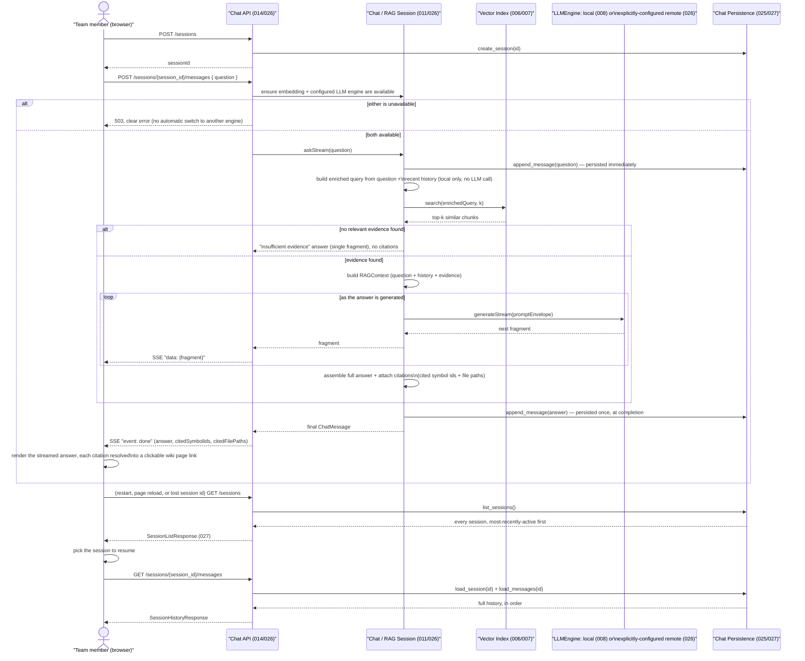

# Major Function: Ask a Question (Chat / RAG)

**Specs**: 011, 014, 025, 026, 027

A user asks a natural-language question and gets back an answer grounded in the
actual codebase, with clickable citations — never an unsourced or hallucinated claim.
The answer streams back fragment by fragment as it's generated (026), rather than
arriving as one block once generation finishes, and a follow-up question's search is
enriched with recent conversation context (026, local text/citation concatenation
only — no LLM call for this step). The exchange is persisted once, at completion
(025), so it survives a server restart or a wiki page reload — see
`01-full-indexing.md`'s storage note and `docs/architecture.md`'s "Storage
architecture" for where `chat_sessions`/`chat_messages` live. A client that lost
track of which session it was using can list every existing session and pick the
right one to resume (027), rather than being limited to a session id it already
happens to know.

