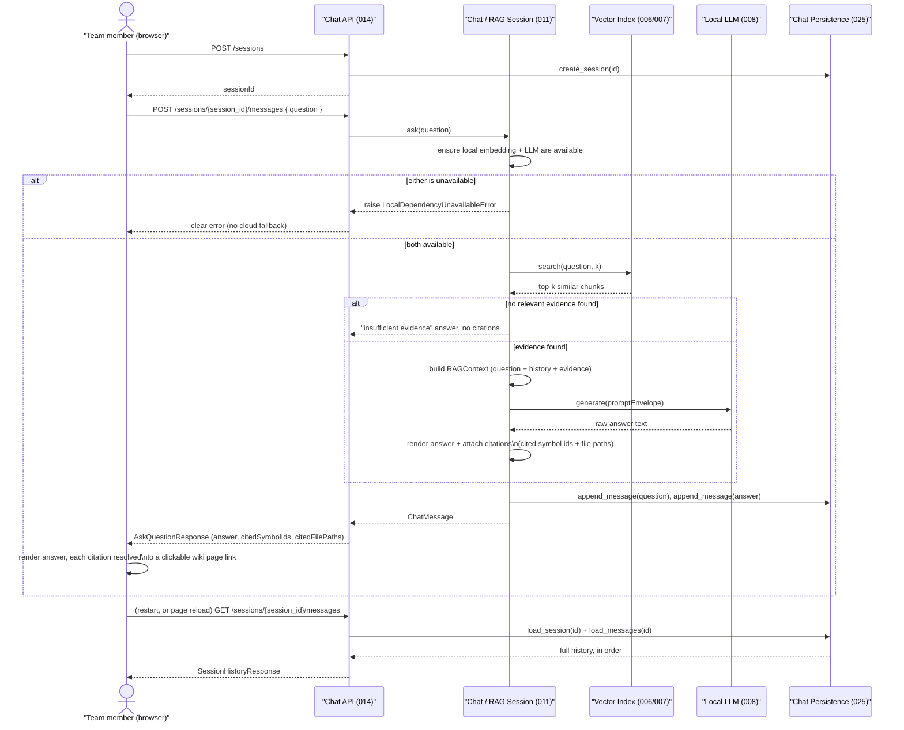

# Major Function: Ask a Question (Chat / RAG)

**Specs**: 011, 014, 025

A user asks a natural-language question and gets back an answer grounded in the
actual codebase, with clickable citations — never an unsourced or hallucinated claim.
The exchange is persisted as it happens (025), so it survives a server restart or a
wiki page reload — see `01-full-indexing.md`'s storage note and
`docs/architecture.md`'s "Storage architecture" for where `chat_sessions`/
`chat_messages` live.

