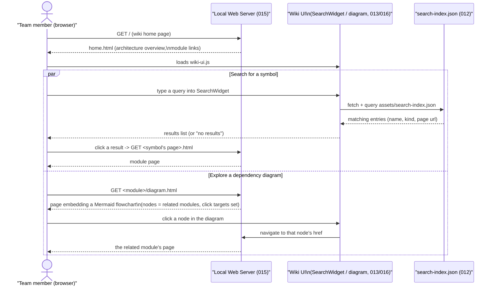

# Major Function: Browse the Wiki, Search, and Navigate a Dependency Diagram

**Specs**: 012, 013, 015, 016

The everyday reading experience: open the wiki, find a symbol by name, or explore how
modules connect to each other by clicking through a live diagram.

