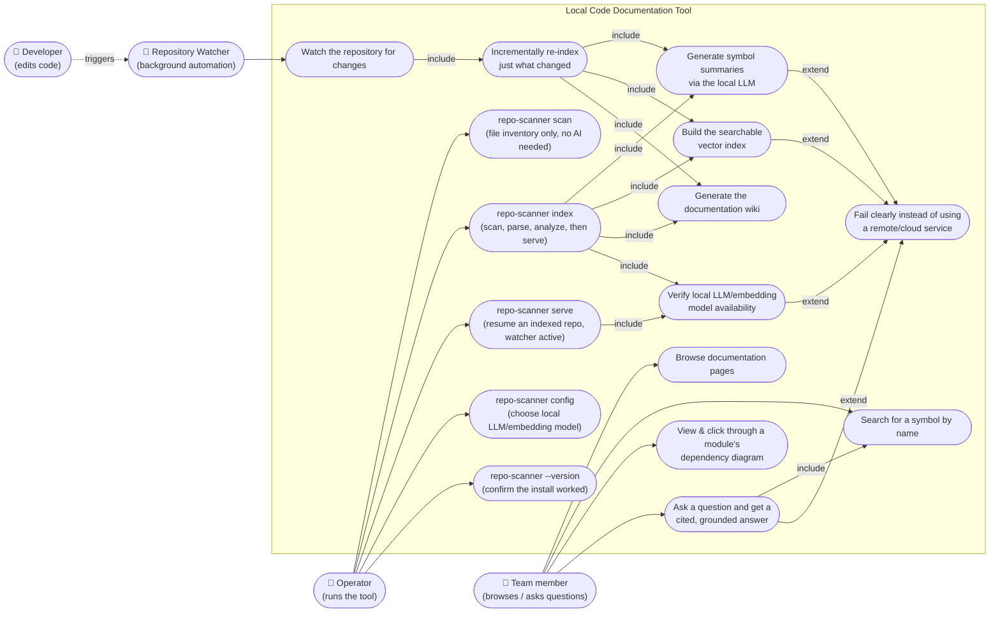

# Project Use Case Diagram

**Scope**: the whole system, one diagram — every primary way a human (or the system's
own automation) interacts with the tool.

> Maintenance: update this diagram whenever a new user-facing capability is added.
> Mermaid has no native UML use-case diagram type, so this is a `flowchart` that mimics
> one: actor nodes linked to oval "use case" nodes inside a system-boundary `subgraph`,
> with `-->|include|` / `-->|extend|` labeled arrows standing in for UML's
> `<<include>>` / `<<extend>>` relationships.

